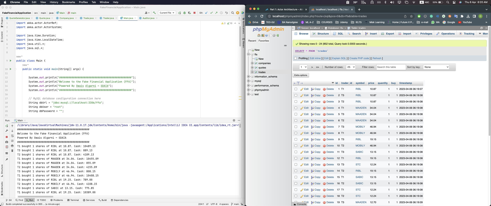

# Java ( Fake Financial App ) with Akka Framework

This repository contains an example of a fake financial application built using the Akka framework in Java.
The purpose of this application is to simulate trading in making virtual money. The application is composed of several components, including a quote generator, traders, and an auditor.

## Components

- **Quote Generator**: An unrealistic simulator that generates stock quotes for five fictional companies. The generated quotes are published to a MySQL database, which traders use to make decisions based on the current price.

- **Traders**: A set of components that receive quotes from the quote generator and decide whether to buy or sell shares. Their decisions are based on their current amount of money and particular trading strategy.

- **Auditor**: A component that keeps track of all trading operations. It receives operations from traders and stores them in a MySQL database for further analysis.

## Project Setup

1. The project was set up using the Maven build tool.
2. Add necessary dependencies, such as Akka and MySQL Connector/J.

## Implementation Steps

1. **Create data models** for Company, Quote, and Trade.
2. **Implement the Quote Generator** as an Akka actor that periodically generates random stock quotes and publishes them to a MySQL database.
3. **Implement the Traders** as Akka actors that consume quotes, make trading decisions based on a particular strategy, and send their operations to the Auditor.
4. **Implement the Auditor** as an Akka actor that receives trade operations and stores them in the MySQL database.
5. **Set up the Akka actor system** (Main) by initializing the system, instantiating the actors, and setting up communication between them using Akka messaging.

## Testing and Analysis

After running the application, I ensured the data was correct in MySQL database and the system was running correctly. I also implement print statements to display the results in real-time.

## Screenshots

